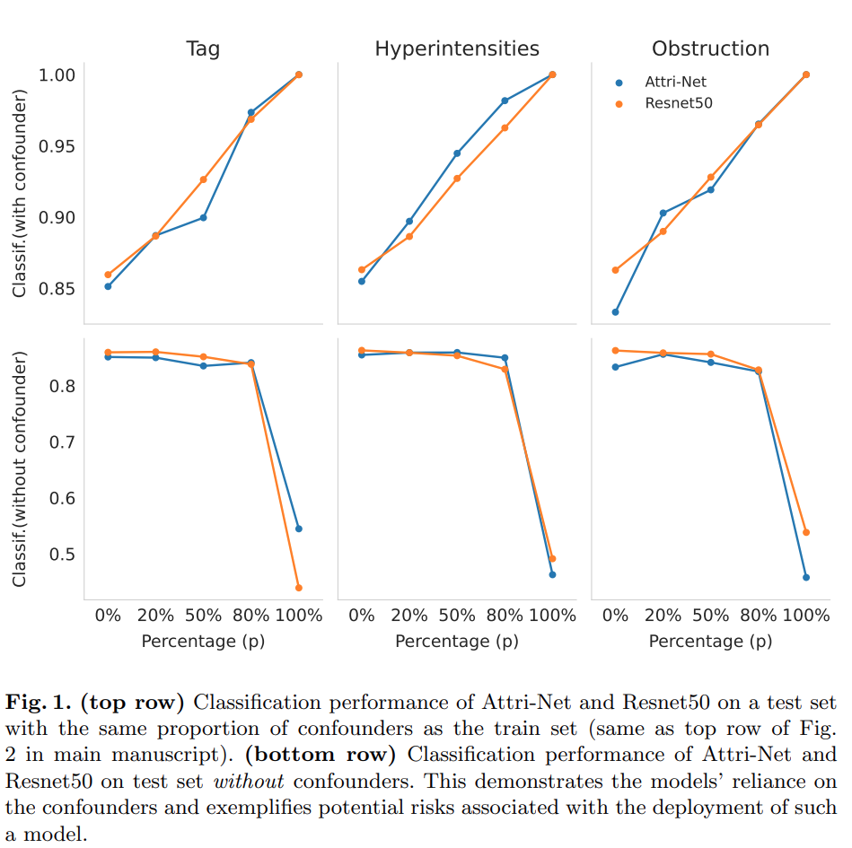
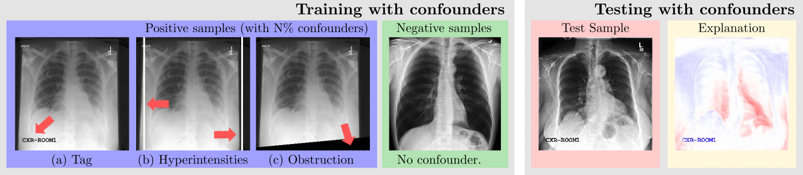
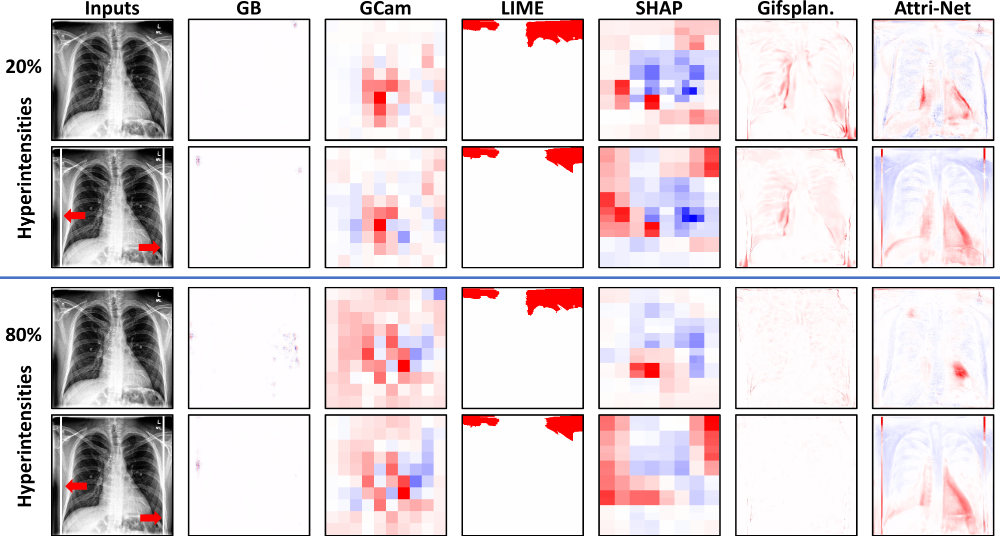
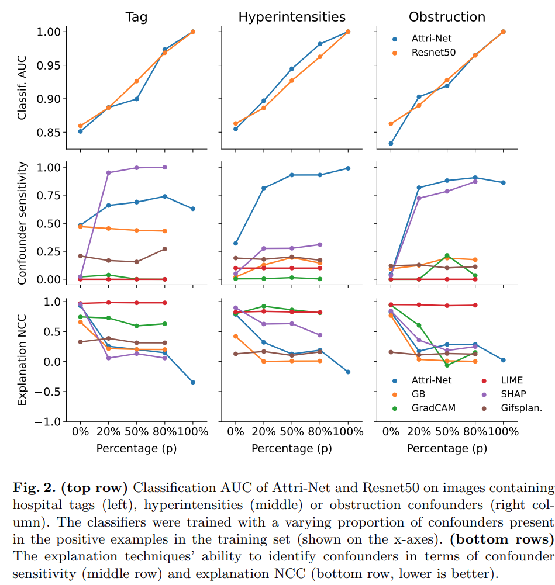

## Right for the Wrong Reason
Official implementation for MICCAI 2023 paper: **Right for the Wrong Reason: Can Interpretable ML Techniques Detect Spurious Correlations?**
[Arxiv Paper](https://arxiv.org/abs/2307.12344)

## Overview of Experiment settings

<div style="displaystyle=block;align=center;"><p align="center" >
  
  </p>
</div>


We evaluated both post-hoc explanation methods and the inherently interpretable model in detecting the spurious signals the model used.

<div style="displaystyle=block;align=center;"><p align="center" >
  
  </p>
</div>


## Results
<div style="displaystyle=block;align=center;"><p align="center" >
  
  </p>
</div>

<div style="displaystyle=block;align=center;"><p align="center" >
  
  </p>
</div>

## Installation

```
conda env create -f right_for_wrong.yml
conda activate right_for_wrong
```


## Datasets
We perform evaluations with the following three Chest X-ray datasets.
**CheXpert** (https://stanfordmlgroup.github.io/competitions/chexpert/)

# References
If you use any of the code in this repository for your research, please cite as:
```
 @misc{sun2023right,
      title={Right for the Wrong Reason: Can Interpretable ML Techniques Detect Spurious Correlations?}, 
      author={Susu Sun and Lisa M. Koch and Christian F. Baumgartner},
      year={2023},
      eprint={2307.12344},
      archivePrefix={arXiv},
      primaryClass={cs.LG}
}
}
