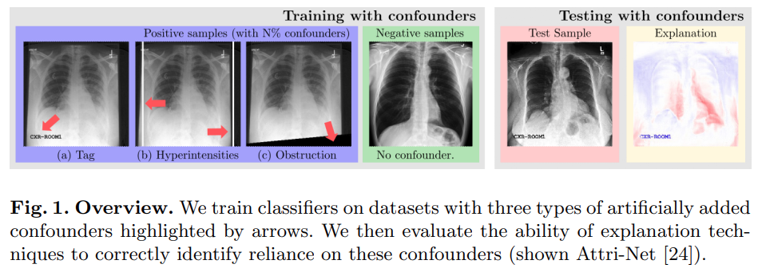

## Right for the Wrong Reason
Official implementation for MICCAI 2023 paper: **Right for the Wrong Reason: Can Interpretable ML Techniques Detect Spurious Correlations?**
[Arxiv Paper](https://arxiv.org/abs/2307.12344)

**Note**: For any questions regarding the paper and code, contact Susu Sun with susu.sun@uni-tuebingen.de.


## Overview of Experiment settings
We performed a rigorous evaluation of post-hoc explanations and inherently interpretable techniques for the detection of spurious correlations in a medical imaging task.
* We designed three kinds of spurious signals named "Tag", "Hyperintensities" and "Obstruction" and contaminated the positive samples in the train set with ratios of 0%, 20%, 50%, 80%, and 100%.
* We designed two novel metrics named "Confounder Sensitivity" and "Explanation NCC" to evaluate five post-hoc explanation methods and one inherently interpretable model in their ability to detect the spurious signal.

<div style="displaystyle=block;align=center;"><p align="center" >
  
  </p>
</div>


## Installation

```
conda env create -f right_for_wrong.yml
conda activate right_for_wrong
```


## Datasets
We perform experiments on the **CheXpert-v1.0-small** dataset. It is a small version of the original CheXpert dataset with resized chest x-ray images.

This dataset can be downloaded with Kaggle (https://www.kaggle.com/datasets/ashery/chexpert)

The **official CheXpert** can be found with (https://stanfordmlgroup.github.io/competitions/chexpert/)

It is also possible to perform on dataset VinDr-CXR (https://vindr.ai/datasets/cxr). You need to download and preprocess the dataset using scripts (https://github.com/ss-sun/Attri-Net/blob/master/data/preprocess_nih_vindr_datasets.py).


## How to use the code
**Step 1**: Generate the contaminated datasets with ratios of 0%, 20%, 50%, 80% and 100% and spurious signals "Tag", "Hyperintensities" and "Obstruction".
* Set the SRC_DATA_ROOT and TGT_DATA_ROOT in ``` data/contaminate_data_settings.py```
* Run ```data/contaminate_data.py``` by setting the ```contaminated_dataset, contaminated_class, contamination_type and contamination_scale```. E.g ```python3 ./data/contaminate_data.py --contaminated_dataset chexpert --contaminated_class "Cardiomegaly" --contamination_type tag --contamination_scale 1```

**Step 2**: Train ResNet50 and Attri-Net on the contaminated datasets.
* Set experiment relevant parameters in ```parser.py```.
* Train ResNet50 or Attri-Net by setting the parameter ```which_model``` to ```resnet``` or ```attrinet``` in ```main.py```. E.g. ```python3 main.py --dataset chexpert --contaminated_class "Cardiomegaly" --contaim_type hyperintensities --contaim_scale 2```

**Step 3**: Generate confounder masks and select the flipped samples to prepare for the evaluation.
* Run ```create_confounder_mask.py``` to create ground truth confounder masks for three signals "Tag", "Hyperintensities" and "Obstruction".
* Set the trained models' path in ```models_dict.py```, and run ```select_flip_prediction_samples.py``` to select the flipped prediction samples.

**Step 4**: Perform evaluations of XAI methods.
* Run ```create_results_dict.py``` to create a result dictionary for collecting all the evaluation results.
* Evaluate the classification performance with ```eval_auc.py```. Evaluate the explanation NCC and confounder sensitivity with ```spurious_detection_eval.py```.


## Results
**Qualitative evaluation** 

<div style="displaystyle=block;align=center;"><p align="center" >
  
  </p>
</div>

**Quantitative evaluation**
<div style="displaystyle=block;align=center;"><p align="center" >
  
  </p>
</div>


# References
If you use any of the code in this repository for your research, please cite as:
```
 @misc{sun2023right,
      title={Right for the Wrong Reason: Can Interpretable ML Techniques Detect Spurious Correlations?}, 
      author={Susu Sun and Lisa M. Koch and Christian F. Baumgartner},
      year={2023},
      eprint={2307.12344},
      archivePrefix={arXiv},
      primaryClass={cs.LG}
}
}
